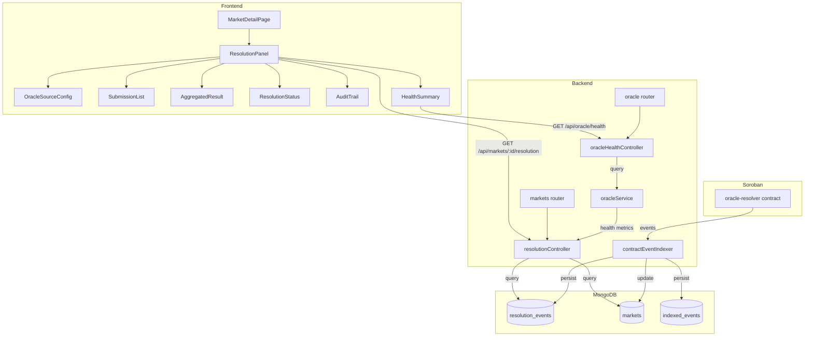

# Design Document: Market Resolution Transparency

## Overview

This feature adds full resolution lifecycle visibility to the Oryn Finance prediction market platform. Users currently have no way to inspect how market outcomes are determined — which oracle sources were queried, what each oracle submitted, how votes were aggregated, or when the dispute period ends. This erodes trust.

The design surfaces that data through two new backend REST endpoints and a new `ResolutionPanel` React component rendered on each market's detail page. All resolution data is persisted in MongoDB by the existing `contractEventIndexer` service, making it available even when the Soroban RPC is temporarily unreachable.

### Key Design Decisions

- **Single aggregated endpoint** (`GET /api/markets/:id/resolution`) returns all resolution data in one call, minimising frontend round-trips and keeping the API surface small.
- **Graceful degradation**: when the Soroban contract is unreachable the endpoint falls back to MongoDB-persisted data and signals this with a `contract_data_unavailable` flag.
- **Append-only audit log**: resolution events are stored in a dedicated `resolution_events` MongoDB collection with a unique index on `(txHash, eventType)` to enforce idempotency.
- **No new Soroban contracts**: the existing `oracle-resolver` contract already emits `resolution_submitted` and `resolution_finalized` events; this feature only adds indexing and exposure of that data.

---

## Architecture



### Data Flow

1. The `oracle-resolver` Soroban contract emits `resolution_submitted`, `resolution_finalized`, and `resolution_disputed` events on-chain.
2. `contractEventIndexer` polls for new events every 30 seconds, processes them, and persists them to the `resolution_events` collection and updates the `markets` collection.
3. When a client calls `GET /api/markets/:id/resolution`, `resolutionController` assembles the response from MongoDB (and optionally from a live Soroban query for the current dispute deadline).
4. `GET /api/oracle/health` reads health metrics directly from the in-memory `oracleService` singleton.
5. The `ResolutionPanel` React component fetches both endpoints and renders the full resolution lifecycle.

---

## Components and Interfaces

### Backend: New Files

#### `backend/src/controllers/resolutionController.js`

Handles `GET /api/markets/:id/resolution`. Responsibilities:
- Load the market document from MongoDB.
- Load all `resolution_events` for the market from MongoDB.
- Optionally query the live Soroban `oracle-resolver` contract for the current `MarketResolution` state (dispute deadline, vote counts).
- Assemble and return the `ResolutionResponse` shape.
- Return `contract_data_unavailable: true` if the Soroban query fails.

```javascript
// Pseudocode interface
class ResolutionController {
  static async getMarketResolution(req, res) // GET /api/markets/:id/resolution
}
```

#### `backend/src/controllers/oracleHealthController.js`

Handles `GET /api/oracle/health`. Reads `oracleService.getSourceHealthStatus()` and formats the response.

```javascript
class OracleHealthController {
  static async getOracleHealth(req, res) // GET /api/oracle/health
}
```

#### `backend/src/models/ResolutionEvent.js`

New Mongoose model for the append-only audit log.

```javascript
// Schema fields
{
  marketId:      String,   // required, indexed
  eventType:     String,   // enum: oracle_submission | consensus_reached | dispute_period_started
                           //       resolution_disputed | resolution_finalized | manual_resolution
  actorAddress:  String,   // oracle address, disputer address, or 'system'
  outcome:       Boolean,  // for oracle_submission events
  confidenceScore: Number, // 0.0–1.0, for oracle_submission events
  proofDataHash: String,   // keccak/sha256 of proof bytes, for oracle_submission events
  payload:       Mixed,    // full event payload
  ledger:        Number,   // Stellar ledger number
  txHash:        String,   // required, indexed
  timestamp:     Date,     // required
  processedAt:   Date
}
// Unique index: { txHash: 1, eventType: 1 }
```

### Backend: Modified Files

#### `backend/src/routes/markets.js`

Add one new route:
```javascript
router.get('/:id/resolution', optionalAuth, asyncHandler(resolutionController.getMarketResolution));
```

#### `backend/src/routes/oracle.js` (new file)

```javascript
router.get('/health', asyncHandler(oracleHealthController.getOracleHealth));
```

Registered in `server.js` as `this.app.use('/api/oracle', oracleRoutes)`.

#### `backend/src/services/contractEventIndexer.js`

Extend the existing `handleResolutionSubmitted`, `handleResolutionDisputed`, and `handleResolutionFinalized` handlers to also write to the `ResolutionEvent` collection (currently they only log or do minimal updates).

### Frontend: New Files

#### `frontend/src/components/ResolutionPanel/index.jsx`

Top-level component rendered on the market detail page. Fetches `/api/markets/:id/resolution` and `/api/oracle/health`, then renders sub-components.

Sub-components:
- `OracleSourceConfig` — displays oracle source type, config parameters, and weights.
- `SubmissionList` — renders each oracle submission as a table row.
- `AggregatedResult` — shows aggregated outcome, confidence bar, and weight breakdown.
- `ResolutionStatus` — status badge, dispute countdown timer, finalization link.
- `AuditTrail` — vertical timeline of resolution events with expandable payloads.
- `HealthSummary` — per-source health indicators.

---

## Data Models

### `ResolutionEvent` (MongoDB)

| Field | Type | Notes |
|---|---|---|
| `marketId` | String | Indexed |
| `eventType` | String | Enum (see above) |
| `actorAddress` | String | Oracle/disputer/system |
| `outcome` | Boolean | For submission events |
| `confidenceScore` | Number | 0.0–1.0 |
| `proofDataHash` | String | Hash of on-chain proof bytes |
| `payload` | Mixed | Full raw event payload |
| `ledger` | Number | Stellar ledger sequence |
| `txHash` | String | Stellar transaction hash |
| `timestamp` | Date | Event timestamp |
| `processedAt` | Date | Indexer processing time |

Unique compound index: `{ txHash: 1, eventType: 1 }` — enforces idempotency.

### `Market` (MongoDB) — additions

Two new fields added to the existing schema:

| Field | Type | Notes |
|---|---|---|
| `resolutionFinalizationTxHash` | String | Set when `resolution_finalized` event is indexed |
| `resolutionFinalizationTimestamp` | Date | Set when `resolution_finalized` event is indexed |

### `GET /api/markets/:id/resolution` — Response Shape

```json
{
  "success": true,
  "data": {
    "marketId": "market_123",
    "oracle_source": "coingecko",
    "oracle_config": {
      "symbol": "bitcoin",
      "targetPrice": 100000,
      "condition": "above"
    },
    "resolution_status": "dispute_period",
    "submissions": [
      {
        "oracleAddress": "GABC...",
        "outcome": "yes",
        "confidenceScore": 0.95,
        "submittedAt": "2025-01-15T10:00:00Z",
        "txHash": "abc123...",
        "explorerUrl": "https://stellar.expert/explorer/testnet/tx/abc123"
      }
    ],
    "vote_tally": {
      "yes": 2,
      "no": 0,
      "threshold": 2
    },
    "source_disagreement": false,
    "aggregated_result": {
      "outcome": "yes",
      "method": "weighted",
      "yes_weight": 1.35,
      "no_weight": 0.0,
      "confidence": 0.95,
      "low_confidence": false,
      "breakdown": [
        {
          "source": "coingecko",
          "outcome": "yes",
          "confidence": 0.95,
          "weight": 0.38
        }
      ]
    },
    "dispute_info": {
      "deadline": "2025-01-22T10:00:00Z",
      "seconds_remaining": 518400,
      "finalization_tx_hash": null,
      "finalization_timestamp": null
    },
    "audit_trail": [
      {
        "eventType": "oracle_submission",
        "actorAddress": "GABC...",
        "payload": { "outcome": true, "confidence": 0.95 },
        "ledger": 54321,
        "txHash": "abc123...",
        "timestamp": "2025-01-15T10:00:00Z",
        "explorerUrl": "https://stellar.expert/explorer/testnet/tx/abc123"
      }
    ],
    "contract_data_unavailable": false
  }
}
```

### `GET /api/oracle/health` — Response Shape

```json
{
  "success": true,
  "data": {
    "sources": [
      {
        "name": "coingecko",
        "successCount": 142,
        "failureCount": 3,
        "failureRate": 0.021,
        "isHealthy": true,
        "lastFailure": "2025-01-14T08:30:00Z"
      },
      {
        "name": "sports-api",
        "successCount": 10,
        "failureCount": 5,
        "failureRate": 0.333,
        "isHealthy": false,
        "lastFailure": "2025-01-15T09:00:00Z"
      }
    ]
  }
}
```

---

## Correctness Properties

*A property is a characteristic or behavior that should hold true across all valid executions of a system — essentially, a formal statement about what the system should do. Properties serve as the bridge between human-readable specifications and machine-verifiable correctness guarantees.*

### Property 1: Resolution response always contains required top-level fields

*For any* market that exists in the database, a call to `GET /api/markets/:id/resolution` SHALL return a response body containing all of the following fields: `oracle_source`, `oracle_config`, `resolution_status`, `submissions`, `aggregated_result`, `dispute_info`, and `audit_trail`.

**Validates: Requirements 6.5**

---

### Property 2: Resolution status is always a valid enum value

*For any* market, the `resolution_status` field returned by the resolution endpoint SHALL be one of: `pending`, `in_progress`, `consensus_reached`, `dispute_period`, `finalized`, or `manual_required`.

**Validates: Requirements 4.1**

---

### Property 3: Vote tally is consistent with submissions list

*For any* set of oracle submissions stored for a market, the `vote_tally.yes` count plus `vote_tally.no` count SHALL equal the total number of entries in the `submissions` array.

**Validates: Requirements 2.2**

---

### Property 4: Source disagreement flag is correct

*For any* set of oracle submissions, `source_disagreement` SHALL be `true` if and only if the submissions contain at least two entries with different `outcome` values.

**Validates: Requirements 2.3**

---

### Property 5: Low confidence flag is correct

*For any* aggregated result, `low_confidence` SHALL be `true` if and only if the `confidence` value is strictly less than 0.6.

**Validates: Requirements 3.3**

---

### Property 6: Audit trail is in ascending chronological order

*For any* market with two or more resolution events, the `audit_trail` array returned by the resolution endpoint SHALL be sorted such that for every consecutive pair of entries `(a, b)`, `a.timestamp <= b.timestamp` and `a.ledger <= b.ledger`.

**Validates: Requirements 5.3**

---

### Property 7: Audit trail completeness — all persisted events appear

*For any* set of resolution events persisted to the `resolution_events` collection for a market, all of those events SHALL appear in the `audit_trail` returned by the resolution endpoint for that market.

**Validates: Requirements 5.1, 5.2**

---

### Property 8: Oracle health threshold is correctly applied

*For any* oracle source, `is_healthy` SHALL be `false` if and only if `failureRate > 0.30`.

**Validates: Requirements 7.3**

---

### Property 9: Oracle health response covers all configured sources

*For any* set of oracle sources configured in `oracleService`, the `GET /api/oracle/health` response SHALL contain exactly one entry per configured source, each with `name`, `successCount`, `failureCount`, `failureRate`, and `isHealthy` fields.

**Validates: Requirements 7.2**

---

### Property 10: Resolution event persistence is idempotent

*For any* resolution event (identified by `txHash` and `eventType`), processing that event a second time SHALL result in exactly the same number of `resolution_events` documents as processing it once — no duplicate entries are created.

**Validates: Requirements 8.5**

---

### Property 11: Resolution event persistence is complete

*For any* `resolution_submitted` event payload received by the indexer, after processing, the `resolution_events` collection SHALL contain a document with `oracleAddress`, `outcome`, `proofDataHash`, `confidenceScore`, `timestamp`, and `txHash` fields matching the event payload.

**Validates: Requirements 8.1**

---

## Error Handling

### `GET /api/markets/:id/resolution`

| Condition | HTTP Status | Response |
|---|---|---|
| Market not found | 404 | `{ "success": false, "message": "Market not found" }` |
| Soroban RPC unreachable | 200 | Full off-chain response + `"contract_data_unavailable": true` |
| MongoDB query error | 500 | Standard error handler response |
| Response time > 3000ms | — | Soroban query is skipped; off-chain data returned immediately |

### `GET /api/oracle/health`

| Condition | HTTP Status | Response |
|---|---|---|
| oracleService not initialised | 503 | `{ "success": false, "message": "Oracle service unavailable" }` |

### `contractEventIndexer` — resolution event handlers

- Duplicate events (same `txHash` + `eventType`) are silently ignored via MongoDB upsert with `$setOnInsert`.
- Malformed event payloads are logged at `error` level and skipped; they do not crash the indexer.
- If the `markets` collection update fails for a `resolution_finalized` event, the error is logged and the `resolution_events` write is still committed (partial persistence is acceptable; the market record can be repaired on the next event).

### Frontend `ResolutionPanel`

- If the `/resolution` endpoint returns `contract_data_unavailable: true`, a banner is shown: "Live contract data is temporarily unavailable. Showing last known resolution state."
- If the endpoint returns a non-2xx status, the panel renders an error state with a retry button.
- If `/api/oracle/health` fails, the `HealthSummary` sub-component renders a "Health data unavailable" placeholder rather than crashing the panel.

---

## Testing Strategy

### Unit Tests

Unit tests cover specific examples, edge cases, and pure logic:

- `resolutionController`: test 404 for unknown market ID; test `contract_data_unavailable` flag when Soroban mock throws; test correct assembly of response shape from mock DB data.
- `oracleHealthController`: test that `getSourceHealthStatus()` output is correctly mapped to the response shape.
- `ResolutionEvent` model: test unique index enforcement (duplicate insert should fail); test schema validation.
- `contractEventIndexer` handlers: test `handleResolutionSubmitted` writes correct fields; test `handleResolutionFinalized` updates market record; test duplicate event is ignored.
- Frontend `ResolutionPanel`: snapshot tests for each sub-component with representative props; test conditional rendering (warning banner, countdown timer, caution notice).

### Property-Based Tests

Property-based testing is appropriate here because the feature involves data transformation logic (aggregation, status derivation, ordering) where input variation meaningfully exercises edge cases. The project uses JavaScript/Node.js; the recommended PBT library is **fast-check**.

Each property test runs a minimum of **100 iterations**.

Tag format: `Feature: market-resolution-transparency, Property {N}: {property_text}`

**Property 1** — Resolution response always contains required top-level fields
Generate random market documents and mock DB responses. Verify all required fields are present in every response.
`// Feature: market-resolution-transparency, Property 1: resolution response always contains required top-level fields`

**Property 2** — Resolution status is always a valid enum value
Generate random combinations of market state (resolved, active, expired) and resolution event sets. Verify the derived `resolution_status` is always one of the six valid values.
`// Feature: market-resolution-transparency, Property 2: resolution_status is always a valid enum value`

**Property 3** — Vote tally is consistent with submissions list
Generate random arrays of oracle submission objects. Verify `yes_count + no_count === submissions.length`.
`// Feature: market-resolution-transparency, Property 3: vote tally is consistent with submissions list`

**Property 4** — Source disagreement flag is correct
Generate random arrays of submissions with randomly assigned outcomes. Verify `source_disagreement === (unique outcomes > 1)`.
`// Feature: market-resolution-transparency, Property 4: source_disagreement flag is correct`

**Property 5** — Low confidence flag is correct
Generate random confidence values in [0, 1]. Verify `low_confidence === (confidence < 0.6)`.
`// Feature: market-resolution-transparency, Property 5: low_confidence flag is correct`

**Property 6** — Audit trail is in ascending chronological order
Generate random sets of resolution events with random timestamps and ledger numbers. After sorting by the controller logic, verify the output is in ascending order.
`// Feature: market-resolution-transparency, Property 6: audit trail is in ascending chronological order`

**Property 7** — Audit trail completeness
Generate random sets of resolution events. Verify every event in the input set appears in the output audit trail.
`// Feature: market-resolution-transparency, Property 7: audit trail completeness`

**Property 8** — Oracle health threshold is correctly applied
Generate random `(successCount, failureCount)` pairs. Compute `failureRate = failureCount / (successCount + failureCount)`. Verify `isHealthy === (failureRate <= 0.30)`.
`// Feature: market-resolution-transparency, Property 8: oracle health threshold is correctly applied`

**Property 9** — Oracle health response covers all configured sources
Generate random sets of oracle source names. Verify the health response contains exactly one entry per source.
`// Feature: market-resolution-transparency, Property 9: oracle health response covers all configured sources`

**Property 10** — Resolution event persistence is idempotent
Generate random resolution event payloads. Process each event twice using the indexer handler with a mock MongoDB. Verify the collection contains exactly one document per unique `(txHash, eventType)` pair.
`// Feature: market-resolution-transparency, Property 10: resolution event persistence is idempotent`

**Property 11** — Resolution event persistence is complete
Generate random `resolution_submitted` event payloads. Process each through the indexer handler. Verify the persisted document contains all required fields with values matching the input payload.
`// Feature: market-resolution-transparency, Property 11: resolution event persistence is complete`

### Integration Tests

- `GET /api/markets/:id/resolution` end-to-end with a seeded MongoDB: verify correct 200 response shape, 404 for unknown ID, and `contract_data_unavailable` flag when Soroban RPC is mocked to fail.
- `GET /api/oracle/health` end-to-end: verify response shape and that `isHealthy` reflects the in-memory health state.
- `contractEventIndexer` with a real MongoDB test instance: process a sequence of resolution events and verify the `resolution_events` collection and `markets` collection are updated correctly.
- Response time: verify `GET /api/markets/:id/resolution` responds within 3000ms with a seeded database (Soroban query mocked).
