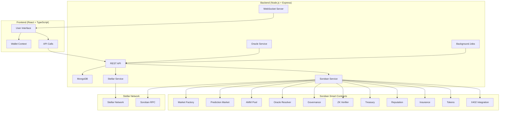

# ORYN MARKETS - DECENTRALIZED PREDICTION MARKET IMPLEMENTATION

## 🎯 Overview

Oryn Markets is a comprehensive decentralized prediction market platform built on the Stellar blockchain using Soroban smart contracts. The platform enables users to create prediction markets, trade on outcomes, and participate in governance.

## 🏗️ Architecture Overview



## 📦 Component Breakdown

### 🎨 Frontend Components
- **Framework**: React 18 + TypeScript + Vite
- **UI Library**: Shadcn/ui + Radix UI + Tailwind CSS
- **State Management**: React Context + TanStack Query
- **3D Graphics**: Three.js + React Three Fiber

### 🔧 Backend Services
- **API Server**: Express.js with RESTful endpoints
- **Database**: MongoDB with Mongoose ODM
- **Blockchain**: Stellar SDK + Soroban integration
- **Real-time**: Socket.io WebSocket server
- **Background**: Node-cron scheduled jobs

### 📜 Smart Contracts (Soroban)
- **Market Factory**: Creates and manages markets
- **Prediction Market**: Core market logic and trading
- **AMM Pool**: Automated market maker for pricing
- **Oracle Resolver**: Multi-oracle resolution system
- **Governance**: Community governance and voting
- **ZK Verifier**: Zero-knowledge proof verification
- **Treasury**: Platform treasury management
- **Reputation**: User reputation scoring
- **Insurance**: Market insurance and dispute handling
- **Tokens**: Custom token management
- **X402 Integration**: Payment protocol integration

## 🔗 Integration Points

### 1. Frontend ↔ Backend Integration

#### **API Communication**
```typescript
// Frontend API Service
const API_BASE = 'http://localhost:5000/api/v1'

// Market data fetching
const getMarkets = async () => {
  const response = await fetch(`${API_BASE}/markets`)
  return response.json()
}

// Real-time updates via WebSocket
const socket = io('http://localhost:5000')
socket.on('market_update', (data) => {
  // Update market data in real-time
})
```

#### **Wallet Integration**
```typescript
// Frontend Wallet Context
const { connect, disconnect, address, isConnected } = useWallet()

// Connect to Freighter Wallet
await connect() // Connects to Stellar wallet
```

#### **State Management**
```typescript
// React Query for data fetching
const { data: markets, isLoading } = useQuery({
  queryKey: ['markets'],
  queryFn: getMarkets
})
```

### 2. Backend ↔ Contracts Integration

#### **Soroban Service**
```javascript
// Backend Soroban Integration
class SorobanService {
  // Deploy contracts
  async deployContract(sourceKeypair, wasmHash, initArgs)
  
  // Invoke contract methods
  async invokeContract(sourceKeypair, contractAddress, method, args)
  
  // Query contract state
  async queryContract(contractAddress, method, args)
}
```

#### **Market Controller**
```javascript
// Create market via smart contract
const createMarket = async (marketData) => {
  // 1. Create market on blockchain
  const contractResult = await sorobanService.createMarket(marketData)
  
  // 2. Store metadata in database
  const market = await Market.create({
    marketId: contractResult.marketId,
    contractAddress: contractResult.contractAddress,
    ...marketData
  })
  
  return market
}
```

#### **Oracle Service**
```javascript
// Automated market resolution
class OracleService {
  async resolveMarket(marketId) {
    // 1. Fetch oracle data
    const oracleData = await this.fetchOracleData()
    
    // 2. Submit to oracle resolver contract
    await sorobanService.invokeContract(
      'oracle_resolver',
      'submit_resolution',
      [marketId, oracleData.outcome]
    )
  }
}
```

### 3. Contract ↔ Contract Integration

#### **Market Factory → Prediction Market**
```rust
// Market Factory creates new prediction markets
pub fn create_market(
    env: Env,
    creator: Address,
    market_info: MarketInfo,
) -> Result<Address, Error> {
    // Deploy new prediction market contract
    let contract_id = env.deployer().with_current_contract(salt).deploy(prediction_market_wasm);
    
    // Initialize the market
    let client = PredictionMarketClient::new(&env, &contract_id);
    client.initialize(&admin, &oracle, &market_info);
    
    contract_id
}
```

#### **Prediction Market → AMM Pool**
```rust
// Prediction market uses AMM for pricing
pub fn buy_tokens(env: Env, user: Address, is_yes: bool, amount: i128) -> Result<i128, Error> {
    // Get current price from AMM
    let amm_client = AmmPoolClient::new(&env, &get_amm_address(&env));
    let price = amm_client.get_price(&is_yes, &amount);
    
    // Execute trade
    execute_trade(&env, &user, is_yes, amount, price)
}
```

#### **Oracle Resolver → Prediction Market**
```rust
// Oracle resolver settles markets
pub fn finalize_resolution(env: Env, market: Address, outcome: bool) -> Result<(), Error> {
    // Resolve the prediction market
    let market_client = PredictionMarketClient::new(&env, &market);
    market_client.resolve(&outcome);
    
    // Emit settlement event
    env.events().publish(("market_resolved", market), outcome);
}
```

## 🚀 Deployment Guide

### 1. Prerequisites
```bash
# Install dependencies
node -v  # >= 18.0.0
npm -v   # >= 8.0.0
rust --version  # >= 1.70.0
bun -v   # >= 1.0.0 (for frontend)

# Install Stellar CLI
cargo install --locked stellar-cli --features opt
```

### 2. Environment Setup

#### **Backend Environment (.env)**
```env
# Server Configuration
NODE_ENV=production
PORT=5000
FRONTEND_URL=https://oryn-markets.com

# Database
MONGODB_URI=mongodb://localhost:27017/oryn-markets

# Stellar Network
STELLAR_NETWORK=testnet
STELLAR_RPC_URL=https://soroban-testnet.stellar.org
STELLAR_HORIZON_URL=https://horizon-testnet.stellar.org

# Contract Addresses (deployed contracts)
MARKET_FACTORY_CONTRACT=CXXXXXXXXXXXXXXXXXXXXXXXXXXXXXXXXXXXXXXXXXXXXXXXXXXXXXXXX
AMM_ENGINE_CONTRACT=CXXXXXXXXXXXXXXXXXXXXXXXXXXXXXXXXXXXXXXXXXXXXXXXXXXXXXXXX
ORACLE_CONTRACT=CXXXXXXXXXXXXXXXXXXXXXXXXXXXXXXXXXXXXXXXXXXXXXXXXXXXXXXXX

# API Keys
COINGECKO_API_KEY=your_api_key
SPORTS_API_KEY=your_api_key

# Security
JWT_SECRET=your_super_secure_jwt_secret
JWT_EXPIRES_IN=24h
```

#### **Frontend Environment (.env)**
```env
VITE_API_BASE_URL=https://api.oryn-markets.com/api/v1
VITE_WS_URL=wss://api.oryn-markets.com
VITE_STELLAR_NETWORK=testnet
```

### 3. Contract Deployment

#### **Deploy Contracts**
```bash
# Navigate to contracts directory
cd contracts

# Build all contracts
stellar contract build

# Deploy contracts to Stellar testnet
./scripts/deploy-all.sh testnet

# Initialize contracts with configuration
./scripts/initialize-contracts.sh
```

#### **Contract Deployment Script**
```bash
#!/bin/bash
# scripts/deploy-all.sh

NETWORK=$1
ADMIN_KEY="your_admin_secret_key"

echo "Deploying contracts to $NETWORK..."

# Deploy Market Factory
MARKET_FACTORY=$(stellar contract deploy \
  --wasm target/wasm32-unknown-unknown/release/market_factory.wasm \
  --source $ADMIN_KEY \
  --network $NETWORK)

# Deploy Prediction Market Template
PREDICTION_MARKET=$(stellar contract deploy \
  --wasm target/wasm32-unknown-unknown/release/prediction_market.wasm \
  --source $ADMIN_KEY \
  --network $NETWORK)

# Deploy AMM Pool
AMM_POOL=$(stellar contract deploy \
  --wasm target/wasm32-unknown-unknown/release/amm_pool.wasm \
  --source $ADMIN_KEY \
  --network $NETWORK)

# Deploy Oracle Resolver
ORACLE_RESOLVER=$(stellar contract deploy \
  --wasm target/wasm32-unknown-unknown/release/oracle_resolver.wasm \
  --source $ADMIN_KEY \
  --network $NETWORK)

echo "Market Factory: $MARKET_FACTORY"
echo "Prediction Market: $PREDICTION_MARKET"
echo "AMM Pool: $AMM_POOL"
echo "Oracle Resolver: $ORACLE_RESOLVER"
```

### 4. Backend Deployment

#### **Install and Start Backend**
```bash
# Navigate to backend directory
cd backend

# Install dependencies
npm install

# Set up database
npm run seed  # Optional: seed with test data

# Start production server
npm start

# Or with PM2 for production
npm install -g pm2
pm2 start server.js --name oryn-backend
```

#### **Database Setup**
```javascript
// Database initialization
const initializeDatabase = async () => {
  await connectDB()
  
  // Create indexes
  await Market.createIndexes()
  await User.createIndexes()
  await Trade.createIndexes()
  
  console.log('Database initialized successfully')
}
```

### 5. Frontend Deployment

#### **Build and Deploy Frontend**
```bash
# Navigate to frontend directory
cd frontend

# Install dependencies
bun install

# Build for production
bun run build

# Deploy to your hosting service (Vercel, Netlify, etc.)
# Or serve locally
bun run preview
```

#### **Production Build Configuration**
```typescript
// vite.config.ts for production
export default defineConfig({
  build: {
    outDir: 'dist',
    minify: 'terser',
    sourcemap: false,
    rollupOptions: {
      output: {
        manualChunks: {
          vendor: ['react', 'react-dom'],
          ui: ['@radix-ui/react-dialog', '@radix-ui/react-dropdown-menu']
        }
      }
    }
  }
})
```

## 🔧 Configuration & Setup

### 1. Server Configuration
```javascript
// server.js - Main server setup
const app = express()

// Security middleware
app.use(helmet())
app.use(cors({
  origin: process.env.FRONTEND_URL,
  credentials: true
}))

// Rate limiting
app.use(rateLimit({
  windowMs: 15 * 60 * 1000, // 15 minutes
  max: 100 // limit each IP to 100 requests per windowMs
}))

// API routes
app.use('/api/v1/markets', marketRoutes)
app.use('/api/v1/trades', tradeRoutes)
app.use('/api/v1/users', userRoutes)
```

### 2. Database Models
```javascript
// Market model with proper indexing
const marketSchema = new mongoose.Schema({
  marketId: { type: String, required: true, unique: true, index: true },
  question: { type: String, required: true, maxlength: 500 },
  category: { 
    type: String, 
    required: true, 
    enum: ['sports', 'politics', 'crypto', 'entertainment', 'economics', 'technology', 'other'],
    index: true 
  },
  status: { 
    type: String, 
    enum: ['active', 'resolved', 'cancelled', 'expired', 'disputed'], 
    default: 'active', 
    index: true 
  }
})
```

### 3. Contract Integration Service
```javascript
// Soroban service for contract interaction
class SorobanService {
  constructor() {
    this.server = new StellarSdk.SorobanRpc.Server(process.env.SOROBAN_RPC_URL)
    this.networkPassphrase = StellarSdk.Networks.TESTNET
  }
  
  async createMarket(creatorKeypair, marketData) {
    const account = await this.server.loadAccount(creatorKeypair.publicKey())
    
    const transaction = new StellarSdk.TransactionBuilder(account, {
      fee: '1000000',
      networkPassphrase: this.networkPassphrase
    })
      .addOperation(StellarSdk.Operation.invokeContract({
        contract: process.env.MARKET_FACTORY_CONTRACT,
        method: 'create_market',
        args: [
          StellarSdk.nativeToScVal(marketData.question, { type: 'string' }),
          StellarSdk.nativeToScVal(marketData.category, { type: 'string' }),
          StellarSdk.nativeToScVal(marketData.expiresAt, { type: 'u64' })
        ]
      }))
      .setTimeout(30)
      .build()
    
    transaction.sign(creatorKeypair)
    return await this.server.submitTransaction(transaction)
  }
}
```

## 🌐 Production Deployment Checklist

### ✅ Pre-deployment Checklist
- [ ] All environment variables configured
- [ ] Database properly indexed and seeded
- [ ] Smart contracts deployed and verified
- [ ] SSL certificates configured
- [ ] CDN setup for static assets
- [ ] Monitoring and logging configured
- [ ] Backup systems in place
- [ ] Load balancer configured (if needed)

### 🚀 Deployment Steps
1. **Deploy Smart Contracts** to Stellar mainnet
2. **Configure Production Database** with proper indexes
3. **Deploy Backend API** with PM2 or Docker
4. **Build and Deploy Frontend** to CDN
5. **Configure Domain and SSL**
6. **Setup Monitoring** with health checks
7. **Test All Integration Points**

### 📊 Monitoring & Maintenance
```javascript
// Health check endpoint
app.get('/health', (req, res) => {
  res.json({
    status: 'healthy',
    timestamp: new Date().toISOString(),
    version: process.env.npm_package_version,
    database: mongoose.connection.readyState === 1 ? 'connected' : 'disconnected',
    stellar: 'connected' // Check Stellar connection
  })
})
```

### 🔒 Security Considerations
- **Smart Contract Audits**: All contracts should be audited before mainnet deployment
- **API Security**: Rate limiting, input validation, JWT authentication
- **Database Security**: Proper indexing, connection encryption
- **Frontend Security**: CSP headers, XSS protection
- **Infrastructure Security**: HTTPS, secure headers, regular updates

## 📱 Usage Flow

### User Journey
1. **Connect Wallet** → User connects Freighter wallet
2. **Browse Markets** → View active prediction markets
3. **Place Trade** → Buy YES/NO tokens on market outcomes
4. **Monitor Positions** → Track P&L and market performance
5. **Market Resolution** → Oracle resolves market automatically
6. **Claim Winnings** → Winners claim payouts from smart contract

### Market Lifecycle
1. **Market Creation** → User creates market via Market Factory
2. **Trading Phase** → Users trade YES/NO tokens via AMM
3. **Resolution** → Oracle submits outcome data
4. **Dispute Period** → Community can challenge resolution
5. **Settlement** → Winning tokens redeemable for underlying asset

## 🎯 Launch Strategy

### Phase 1: Testnet Launch (Week 1-2)
- Deploy all contracts to Stellar testnet
- Launch frontend and backend on staging environment
- Conduct internal testing and bug fixes
- Community testing with testnet tokens

### Phase 2: Mainnet Soft Launch (Week 3-4)
- Deploy audited contracts to Stellar mainnet
- Launch with limited markets and user base
- Monitor system performance and user feedback
- Gradual scaling of features

### Phase 3: Full Production Launch (Week 5-6)
- Open platform to general public
- Marketing campaign and partnerships
- Additional market categories and features
- Community governance activation

### Key Metrics to Monitor
- **TVL (Total Value Locked)** in all markets
- **Daily Active Users** and trading volume
- **Market Resolution Accuracy** and dispute rates
- **System Performance** and uptime
- **User Acquisition** and retention rates

---

## 📞 Support & Documentation

- **API Documentation**: Available at `/api/docs` (Swagger UI)
- **Smart Contract Docs**: In each contract's `README.md`
- **User Guide**: Available in frontend `/how-it-works` page
- **Developer Resources**: Technical documentation and SDKs

This implementation provides a complete, production-ready decentralized prediction market platform with proper integration between all components.