# 🚀 ORYN FINANCE - Decentralized Prediction Markets Platform

<div align="center">


[](https://stellar.org)
[](https://soroban.stellar.org)

**Next-Generation Decentralized Prediction Markets on Stellar Blockchain**

*Built by Team Brotherhood*

</div>

## 📋 Table of Contents

- [🎯 Overview](#-overview)
- [👥 Team Brotherhood](#-team-brotherhood)
- [🏗️ Architecture](#️-architecture)
- [✨ Features](#-features)
- [🛠️ Technology Stack](#️-technology-stack)
- [📁 Project Structure](#-project-structure)
- [🚀 Quick Start](#-quick-start)
- [📡 API Documentation](#-api-documentation)
- [🔗 Smart Contracts](#-smart-contracts)
- [🌐 Deployed Contracts](#-deployed-contracts)
- [💡 Usage Examples](#-usage-examples)
- [🔒 Security](#-security)
- [🤝 Contributing](#-contributing)
- [📄 License](#-license)

## 🎯 Overview

Oryn Finance is a comprehensive decentralized prediction market platform that enables users to create, trade, and resolve prediction markets on any real-world event. Built on the Stellar blockchain using Soroban smart contracts, Oryn Finance provides a trustless, transparent, and efficient platform for peer-to-peer prediction trading.

### Key Innovations
- **Advanced AMM Algorithm**: Sophisticated automated market making for optimal liquidity
- **Multi-Oracle Integration**: Robust oracle network for reliable market resolution
- **ZK Privacy Layer**: Zero-knowledge proofs for private predictions
- **Insurance Protection**: Built-in insurance against oracle failures and market manipulation
- **Cross-Chain Compatibility**: X402 protocol integration for multi-chain operations
- **Governance Token**: Community-driven platform evolution through $ORYN token


### Snap Shots


## 👥 Team Brotherhood

<table>
  <tr>
    <td align="center">
      
      <br />
      <sub><b>Saikat Bera</b></sub>
      <br />
      <sub>Team Lead & Blockchain Architect</sub>
    </td>
    <td align="center">
      
      <br />
      <sub><b>Rohan Kumar</b></sub>
      <br />
      <sub>Full-Stack Developer</sub>
    </td>
    <td align="center">
      
      <br />
      <sub><b>Jiban Panda</b></sub>
      <br />
      <sub>Frontend Developer & UI/UX</sub>
    </td>
  </tr>
</table>

**Team Brotherhood** is a passionate group of developers committed to building the future of decentralized finance. With expertise spanning blockchain development, full-stack engineering, and user experience design, we're dedicated to creating innovative solutions that empower users in the DeFi ecosystem.

### Team Expertise
- **Blockchain Development**: Stellar, Soroban, Smart Contract Architecture
- **Full-Stack Development**: React, Node.js, TypeScript, MongoDB
- **DeFi Protocols**: AMM, Oracle Integration, Governance Systems
- **UI/UX Design**: Modern interfaces, wallet integration, responsive design

## 🏗️ Architecture

```mermaid
graph TB
    subgraph "Frontend Layer"
        UI[React + TypeScript UI]
        WC[Wallet Context Manager]
        API[API Client Layer]
        WS[WebSocket Client]
    end
    
    subgraph "Backend Services"
        REST[REST API Server]
        AUTH[Authentication Service]
        ORACLE[Oracle Integration Service]
        WS_SERVER[WebSocket Server]
        BG[Background Job Processor]
        CACHE[Redis Cache]
    end
    
    subgraph "Database Layer"
        MONGO[MongoDB]
        INDEXES[Optimized Indexes]
    end
    
    subgraph "Blockchain Layer - Stellar Network"
        HORIZON[Stellar Horizon API]
        RPC[Soroban RPC]
        
        subgraph "Smart Contracts"
            MF[Market Factory]
            PM[Prediction Market]
            AMM[AMM Pool]
            OR[Oracle Resolver]
            GOV[Governance]
            REP[Reputation System]
            INS[Insurance Pool]
            ZK[ZK Verifier]
            TOK[Token Contracts]
            TREAS[Treasury]
            X402[X402 Integration]
        end
    end
    
    subgraph "External Services"
        COINGECKO[CoinGecko API]
        SPORTS[Sports Data API]
        NEWS[News API]
        SOCIAL[Social Media APIs]
    end
    
    subgraph "Wallet Integrations"
        FREIGHTER[Freighter Wallet]
        FIGHTER[Fighter Wallet]
        RABET[Rabet Wallet]
        ALBEDO[Albedo Wallet]
    end
    
    UI --> WC
    UI --> API
    WC --> FREIGHTER
    WC --> FIGHTER
    WC --> RABET
    WC --> ALBEDO
    
    API --> REST
    WS --> WS_SERVER
    
    REST --> AUTH
    REST --> MONGO
    REST --> CACHE
    REST --> HORIZON
    REST --> RPC
    
    ORACLE --> COINGECKO
    ORACLE --> SPORTS
    ORACLE --> NEWS
    ORACLE --> SOCIAL
    
    BG --> MONGO
    BG --> ORACLE
    BG --> RPC
    
    RPC --> MF
    RPC --> PM
    RPC --> AMM
    RPC --> OR
    RPC --> GOV
    RPC --> REP
    RPC --> INS
    RPC --> ZK
    RPC --> TOK
    RPC --> TREAS
    RPC --> X402
    
    OR --> ORACLE
    
    style UI fill:#e1f5fe
    style REST fill:#f3e5f5
    style MONGO fill:#e8f5e8
    style MF fill:#fff3e0
    style PM fill:#fff3e0
    style AMM fill:#fff3e0
```



### Architecture Components

#### **Frontend Layer**
- **React + TypeScript**: Modern, type-safe frontend application
- **Wallet Context Manager**: Unified wallet integration supporting multiple Stellar wallets
- **API Client**: Robust HTTP client with error handling and retry logic
- **WebSocket Client**: Real-time updates for market data and notifications

#### **Backend Services**
- **REST API Server**: Express.js-based API with comprehensive endpoints
- **Authentication Service**: JWT-based authentication with role-based access
- **Oracle Integration**: Multi-source oracle system for reliable data feeds
- **WebSocket Server**: Real-time bidirectional communication
- **Background Jobs**: Automated market resolution, data indexing, and maintenance

#### **Database Layer**
- **MongoDB**: Primary database for application data
- **Optimized Indexes**: Performance-tuned indexes for high-frequency queries
- **Redis Cache**: High-speed caching for frequently accessed data

#### **Blockchain Integration**
- **Stellar Horizon API**: Account management and transaction broadcasting
- **Soroban RPC**: Smart contract interaction and state queries
- **11 Smart Contracts**: Comprehensive DeFi infrastructure

## ✨ Features

### 🎯 **Core Platform Features**
- **Market Creation**: Create prediction markets for any real-world event
- **Advanced Trading**: Buy/sell YES/NO tokens with sophisticated order matching
- **Automated Market Making**: Continuous liquidity through advanced AMM algorithms
- **Real-time Analytics**: Live market data, trading volume, and price charts
- **Portfolio Management**: Track positions, P&L, and transaction history

### 🔐 **Security & Trust**
- **Decentralized Oracle Network**: Multi-source data aggregation for accurate settlements
- **Insurance Pool**: Protection against oracle failures and market manipulation
- **Zero-Knowledge Proofs**: Private prediction capabilities with public verification
- **Audited Smart Contracts**: Security-first development with comprehensive testing

### 💰 **Economic Features**
- **Liquidity Mining**: Earn rewards for providing market liquidity
- **Governance Participation**: Vote on platform upgrades and fee structures
- **Fee Optimization**: Minimal trading fees with revenue sharing
- **Cross-Chain Support**: X402 protocol for multi-blockchain operations

### 🌐 **User Experience**
- **Multi-Wallet Support**: Freighter, Fighter, Rabet, and Albedo wallet integration
- **Responsive Design**: Seamless experience across desktop and mobile
- **Real-time Notifications**: Live updates via WebSocket connections
- **Social Features**: Market discussions, reputation system, leaderboards

## 🛠️ Technology Stack

### **Frontend**
```json
{
  "framework": "React 18 + TypeScript",
  "ui_library": "shadcn/ui + Radix UI",
  "styling": "Tailwind CSS",
  "build_tool": "Vite",
  "wallet_integration": "Stellar SDK + Freighter API",
  "state_management": "React Context + Custom Hooks",
  "charts": "Recharts",
  "animations": "Framer Motion"
}
```

### **Backend**
```json
{
  "runtime": "Node.js",
  "framework": "Express.js",
  "database": "MongoDB + Mongoose",
  "cache": "Redis",
  "authentication": "JWT + bcryptjs",
  "validation": "express-validator",
  "websockets": "Socket.io",
  "blockchain": "Stellar SDK",
  "job_queue": "Bull Queue",
  "testing": "Jest + Supertest"
}
```

### **Blockchain**
```json
{
  "network": "Stellar",
  "smart_contracts": "Soroban (Rust)",
  "wallet_support": ["Freighter", "Fighter", "Rabet", "Albedo"],
  "oracles": ["CoinGecko", "Sports APIs", "News APIs"],
  "consensus": "Stellar Consensus Protocol (SCP)"
}
```

### **DevOps & Infrastructure**
```json
{
  "containerization": "Docker",
  "ci_cd": "GitHub Actions",
  "monitoring": "Winston Logging",
  "documentation": "Swagger/OpenAPI 3.0",
  "security": "Helmet.js + CORS + Rate Limiting"
}
```

## 📁 Project Structure

```
oryn-markets/
├── 📂 frontend/                 # React TypeScript Frontend
│   ├── 📂 src/
│   │   ├── 📂 components/       # Reusable UI components
│   │   ├── 📂 contexts/         # React Context providers
│   │   ├── 📂 hooks/           # Custom React hooks
│   │   ├── 📂 lib/             # Utility libraries
│   │   ├── 📂 pages/           # Route components
│   │   ├── 📂 services/        # API service layers
│   │   ├── 📂 types/           # TypeScript type definitions
│   │   └── 📂 wallet/          # Wallet integration logic
│   ├── 📄 package.json
│   ├── 📄 vite.config.ts
│   └── 📄 tailwind.config.ts
│
├── 📂 backend/                  # Node.js Express Backend
│   ├── 📂 src/
│   │   ├── 📂 config/          # Configuration files
│   │   ├── 📂 controllers/     # Request handlers
│   │   ├── 📂 middleware/      # Express middleware
│   │   ├── 📂 models/          # Database models
│   │   ├── 📂 routes/          # API route definitions
│   │   └── 📂 services/        # Business logic services
│   ├── 📄 server.js            # Application entry point
│   └── 📄 package.json
│
├── 📂 contracts/               # Soroban Smart Contracts
│   ├── 📂 amm-pool/           # Automated Market Maker
│   ├── 📂 governance/         # Governance & Voting
│   ├── 📂 insurance/          # Insurance Pool
│   ├── 📂 market-factory/     # Market Creation
│   ├── 📂 oracle-resolver/    # Oracle Integration
│   ├── 📂 prediction-market/  # Core Market Logic
│   ├── 📂 reputation/         # User Reputation System
│   ├── 📂 tokens/             # Token Contracts
│   ├── 📂 treasury/           # Platform Treasury
│   ├── 📂 x402-integration/   # Cross-chain Protocol
│   ├── 📂 zk-verifier/        # Zero-Knowledge Proofs
│   └── 📄 Cargo.toml
│
├── 📄 README.md               # This file
├── 📄 IMPLEMENTATION.md       # Technical implementation guide
├── 📄 package.json           # Root package.json
└── 📄 .gitignore             # Git ignore rules
```

## 🚀 Quick Start

### Prerequisites
- **Node.js** 18.0.0 or higher
- **npm** or **yarn** package manager
- **MongoDB** 6.0 or higher
- **Redis** 6.0 or higher (optional, for caching)
- **Stellar CLI** for smart contract deployment
- **Freighter Wallet** or compatible Stellar wallet

### 1. Clone Repository
```bash
git clone https://github.com/brotherhood/oryn-finance.git
cd oryn-finance
```

### 2. Install Dependencies
```bash
# Install root dependencies
npm install

# Install backend dependencies
cd backend && npm install

# Install frontend dependencies
cd ../frontend && npm install

# Install contract dependencies (Rust required)
cd ../contracts && cargo build
```

### 3. Environment Setup

#### Backend Environment (backend/.env)
```env
# Server Configuration
NODE_ENV=development
PORT=5001
CORS_ORIGIN=http://localhost:5173

# Database
MONGODB_URI=mongodb://localhost:27017/oryn-finance
REDIS_URL=redis://localhost:6379

# Stellar Configuration
STELLAR_NETWORK=testnet
STELLAR_HORIZON_URL=https://horizon-testnet.stellar.org
SOROBAN_RPC_URL=https://soroban-testnet.stellar.org

# Authentication
JWT_SECRET=your-jwt-secret-key
JWT_EXPIRES_IN=24h

# Oracle APIs
COINGECKO_API_KEY=your-coingecko-api-key
SPORTS_API_KEY=your-sports-api-key
NEWS_API_KEY=your-news-api-key

# Smart Contract Addresses (from deployment)
MARKET_FACTORY_CONTRACT=CCUENLYBXW3WTWBUD2TZLX3EWI7WFD223TW4LSBNQQ5W26B2Q2WNSM6M
PREDICTION_MARKET_CONTRACT=CCDPJ2UFUE5WNDSCIRPXQAT2XU7JZEIJMRNKIO4ANT5MWJNKDXJ4JUQ7
AMM_POOL_CONTRACT=CBVTPYDEAQJL377TFTF6YND4BCMMPR2NR2O22EDPQ77AG7AVCILGUTIA
ORACLE_RESOLVER_CONTRACT=CDCL4MFB6RMCEAY32FOSQFFVDEQO3OXGCRP7YIUXCOVOAREYRQ2PMOOB
GOVERNANCE_CONTRACT=CADJ4FBXLAZLGOASYLXDSQUV6ACB6EPVW2RBMYHUSUQUPOIM4CTFRKR5
```

#### Frontend Environment (frontend/.env)
```env
# API Configuration
VITE_API_BASE_URL=http://localhost:5001
VITE_WS_URL=ws://localhost:5001

# Stellar Configuration
VITE_STELLAR_NETWORK=testnet
VITE_STELLAR_HORIZON_URL=https://horizon-testnet.stellar.org
VITE_SOROBAN_RPC_URL=https://soroban-testnet.stellar.org

# Application Configuration
VITE_APP_NAME=Oryn Finance
VITE_APP_VERSION=1.0.0
```

### 4. Database Setup
```bash
# Start MongoDB service
mongod

# Start Redis (optional)
redis-server

# Initialize database with sample data
cd backend && npm run seed
```

### 5. Smart Contract Deployment
```bash
cd contracts

# Build contracts
stellar contract build

# Deploy to testnet (requires Stellar CLI configuration)
./scripts/deploy-contracts.sh testnet
```

### 6. Start Development Servers

#### Start Backend
```bash
cd backend
npm run dev
# Backend runs on http://localhost:5001
```

#### Start Frontend (New Terminal)
```bash
cd frontend
npm run dev
# Frontend runs on http://localhost:5173
```

### 7. Access Application
- **Frontend**: http://localhost:5173
- **Backend API**: http://localhost:5001
- **API Documentation**: http://localhost:5001/api-docs

## 📡 API Documentation

### Base URL
```
Development: http://localhost:5001/api
Production: https://api.oryn.finance/api
```

### Authentication
```http
POST /auth/login
POST /auth/register
POST /auth/logout
GET  /auth/profile
```

### Markets
```http
GET    /markets                 # List all markets
POST   /markets                 # Create new market
GET    /markets/:id             # Get market details
PUT    /markets/:id             # Update market
DELETE /markets/:id             # Delete market
GET    /markets/:id/trades      # Get market trades
POST   /markets/:id/resolve     # Resolve market
```

### Trading
```http
POST   /trades                  # Place trade
GET    /trades/user/:userId     # Get user trades
GET    /trades/:id              # Get trade details
DELETE /trades/:id              # Cancel trade
```

### Users
```http
GET    /users/profile           # Get user profile
PUT    /users/profile           # Update profile
GET    /users/:id/positions     # Get user positions
GET    /users/:id/trades        # Get user trades
```

### Analytics
```http
GET    /analytics/markets       # Market statistics
GET    /analytics/volume        # Trading volume data
GET    /analytics/leaderboard   # Top traders
GET    /analytics/performance   # Platform metrics
```

### WebSocket Events
```javascript
// Client to Server
socket.emit('subscribe_market', { marketId });
socket.emit('place_order', { marketId, type, amount });

// Server to Client
socket.on('market_update', (data) => { /* Market data */ });
socket.on('trade_executed', (data) => { /* Trade confirmation */ });
socket.on('price_update', (data) => { /* Real-time prices */ });
```

## 🔗 Smart Contracts

### Core Contracts Overview

| Contract | Address | Description |
|----------|---------|-------------|
| **Market Factory** | `CCUENLYBXW3WTWBUD2TZLX3EWI7WFD223TW4LSBNQQ5W26B2Q2WNSM6M` | Creates and manages prediction markets |
| **Prediction Market** | `CCDPJ2UFUE5WNDSCIRPXQAT2XU7JZEIJMRNKIO4ANT5MWJNKDXJ4JUQ7` | Core market logic and trading |
| **AMM Pool** | `CBVTPYDEAQJL377TFTF6YND4BCMMPR2NR2O22EDPQ77AG7AVCILGUTIA` | Automated market making |
| **Oracle Resolver** | `CDCL4MFB6RMCEAY32FOSQFFVDEQO3OXGCRP7YIUXCOVOAREYRQ2PMOOB` | External data integration |
| **Governance** | `CADJ4FBXLAZLGOASYLXDSQUV6ACB6EPVW2RBMYHUSUQUPOIM4CTFRKR5` | Platform governance |
| **Insurance** | `CAC647C2R33OCEHXUE3KWCBA4QTG5YYHCXJNLLG7JZ7NVQDSXOFZ25VS` | Risk protection |
| **Reputation** | `CCGZV643TWW6IGYKUHYYCJABYBNJ5DOAQJXJIQNIUAXBJSDIVADLJB37` | User reputation tracking |
| **ZK Verifier** | `CD32VRK27G26QZNLT2AW35X7IVFPU76GAEOH5XLUH7XRROVH26GRSIOW` | Zero-knowledge proofs |
| **X402 Integration** | `CBKSOAE52ONGDTGGB6CAZAGYEKMJ54WFIDW3U6PBL4FUP75G2H3LWVHS` | Cross-chain protocol |
| **Tokens** | `CCK6QOIU5U3BKRGXAX4O6FJFZVZZNTVQ6TTTJC3TAI4UYLYTSO6Z6HTZ` | Token management |

### Smart Contract Functions

#### Market Factory Contract
```rust
// Create new prediction market
create_market(
    creator: Address,
    question: String,
    end_time: u64,
    oracle_source: String
) -> Address

// List all markets
get_markets() -> Vec<Address>

// Get market details
get_market_info(market_id: Address) -> MarketInfo
```

#### Prediction Market Contract
```rust
// Place buy order
buy_yes_tokens(user: Address, amount: u128) -> Result<(), Error>
buy_no_tokens(user: Address, amount: u128) -> Result<(), Error>

// Sell tokens
sell_yes_tokens(user: Address, amount: u128) -> Result<(), Error>
sell_no_tokens(user: Address, amount: u128) -> Result<(), Error>

// Resolve market
resolve_market(outcome: bool) -> Result<(), Error>

// Claim winnings
claim_winnings(user: Address) -> Result<(), Error>
```

#### AMM Pool Contract
```rust
// Provide liquidity
add_liquidity(
    provider: Address,
    amount_a: u128,
    amount_b: u128
) -> Result<u128, Error>

// Remove liquidity
remove_liquidity(
    provider: Address,
    liquidity_amount: u128
) -> Result<(u128, u128), Error>

// Get price quote
get_price_quote(
    token_in: Address,
    amount_in: u128
) -> u128
```

## 🌐 Deployed Contracts

All smart contracts are deployed on **Stellar Testnet** and verified on Stellar Expert:

### 📋 Contract Deployment Status

| Contract | Status | Testnet Address | Explorer Link |
|----------|--------|-----------------|---------------|
| 🏭 **Market Factory** | ✅ Deployed | `CCUENLYBXW3WTWBUD2TZLX3EWI7WFD223TW4LSBNQQ5W26B2Q2WNSM6M` | [View on Explorer](https://stellar.expert/explorer/testnet/contract/CCUENLYBXW3WTWBUD2TZLX3EWI7WFD223TW4LSBNQQ5W26B2Q2WNSM6M) |
| 🎯 **Prediction Market** | ✅ Deployed | `CCDPJ2UFUE5WNDSCIRPXQAT2XU7JZEIJMRNKIO4ANT5MWJNKDXJ4JUQ7` | [View on Explorer](https://stellar.expert/explorer/testnet/contract/CCDPJ2UFUE5WNDSCIRPXQAT2XU7JZEIJMRNKIO4ANT5MWJNKDXJ4JUQ7) |
| 🔄 **AMM Pool** | ✅ Deployed | `CBVTPYDEAQJL377TFTF6YND4BCMMPR2NR2O22EDPQ77AG7AVCILGUTIA` | [View on Explorer](https://stellar.expert/explorer/testnet/contract/CBVTPYDEAQJL377TFTF6YND4BCMMPR2NR2O22EDPQ77AG7AVCILGUTIA) |
| 🔮 **Oracle Resolver** | ✅ Deployed | `CDCL4MFB6RMCEAY32FOSQFFVDEQO3OXGCRP7YIUXCOVOAREYRQ2PMOOB` | [View on Explorer](https://stellar.expert/explorer/testnet/contract/CDCL4MFB6RMCEAY32FOSQFFVDEQO3OXGCRP7YIUXCOVOAREYRQ2PMOOB) |
| 🏛️ **Governance** | ✅ Deployed | `CADJ4FBXLAZLGOASYLXDSQUV6ACB6EPVW2RBMYHUSUQUPOIM4CTFRKR5` | [View on Explorer](https://stellar.expert/explorer/testnet/contract/CADJ4FBXLAZLGOASYLXDSQUV6ACB6EPVW2RBMYHUSUQUPOIM4CTFRKR5) |
| 🛡️ **Insurance Pool** | ✅ Deployed | `CAC647C2R33OCEHXUE3KWCBA4QTG5YYHCXJNLLG7JZ7NVQDSXOFZ25VS` | [View on Explorer](https://stellar.expert/explorer/testnet/contract/CAC647C2R33OCEHXUE3KWCBA4QTG5YYHCXJNLLG7JZ7NVQDSXOFZ25VS) |
| ⭐ **Reputation** | ✅ Deployed | `CCGZV643TWW6IGYKUHYYCJABYBNJ5DOAQJXJIQNIUAXBJSDIVADLJB37` | [View on Explorer](https://stellar.expert/explorer/testnet/contract/CCGZV643TWW6IGYKUHYYCJABYBNJ5DOAQJXJIQNIUAXBJSDIVADLJB37) |
| 🔐 **ZK Verifier** | ✅ Deployed | `CD32VRK27G26QZNLT2AW35X7IVFPU76GAEOH5XLUH7XRROVH26GRSIOW` | [View on Explorer](https://stellar.expert/explorer/testnet/contract/CD32VRK27G26QZNLT2AW35X7IVFPU76GAEOH5XLUH7XRROVH26GRSIOW) |
| 🌉 **X402 Integration** | ✅ Deployed | `CBKSOAE52ONGDTGGB6CAZAGYEKMJ54WFIDW3U6PBL4FUP75G2H3LWVHS` | [View on Explorer](https://stellar.expert/explorer/testnet/contract/CBKSOAE52ONGDTGGB6CAZAGYEKMJ54WFIDW3U6PBL4FUP75G2H3LWVHS) |
| 🪙 **Token Contracts** | ✅ Deployed | `CCK6QOIU5U3BKRGXAX4O6FJFZVZZNTVQ6TTTJC3TAI4UYLYTSO6Z6HTZ` | [View on Explorer](https://stellar.expert/explorer/testnet/contract/CCK6QOIU5U3BKRGXAX4O6FJFZVZZNTVQ6TTTJC3TAI4UYLYTSO6Z6HTZ) |
| 🏦 **Treasury** | ⏳ Pending | `Coming Soon` | - |

### 🔗 Integration Configuration

```typescript
// Frontend contract configuration
export const CONTRACTS = {
  MARKET_FACTORY: 'CCUENLYBXW3WTWBUD2TZLX3EWI7WFD223TW4LSBNQQ5W26B2Q2WNSM6M',
  PREDICTION_MARKET: 'CCDPJ2UFUE5WNDSCIRPXQAT2XU7JZEIJMRNKIO4ANT5MWJNKDXJ4JUQ7',
  AMM_POOL: 'CBVTPYDEAQJL377TFTF6YND4BCMMPR2NR2O22EDPQ77AG7AVCILGUTIA',
  ORACLE_RESOLVER: 'CDCL4MFB6RMCEAY32FOSQFFVDEQO3OXGCRP7YIUXCOVOAREYRQ2PMOOB',
  GOVERNANCE: 'CADJ4FBXLAZLGOASYLXDSQUV6ACB6EPVW2RBMYHUSUQUPOIM4CTFRKR5',
  INSURANCE: 'CAC647C2R33OCEHXUE3KWCBA4QTG5YYHCXJNLLG7JZ7NVQDSXOFZ25VS',
  REPUTATION: 'CCGZV643TWW6IGYKUHYYCJABYBNJ5DOAQJXJIQNIUAXBJSDIVADLJB37',
  ZK_VERIFIER: 'CD32VRK27G26QZNLT2AW35X7IVFPU76GAEOH5XLUH7XRROVH26GRSIOW',
  X402_INTEGRATION: 'CBKSOAE52ONGDTGGB6CAZAGYEKMJ54WFIDW3U6PBL4FUP75G2H3LWVHS',
  TOKENS: 'CCK6QOIU5U3BKRGXAX4O6FJFZVZZNTVQ6TTTJC3TAI4UYLYTSO6Z6HTZ'
} as const;
```

## 💡 Usage Examples

### Create a Prediction Market
```javascript
// Frontend: Create new market
const createMarket = async () => {
  const marketData = {
    question: "Will Bitcoin reach $150,000 by March 2026?",
    description: "Market resolves based on CoinGecko BTC/USD price",
    endTime: "2026-03-31T23:59:59Z",
    oracleSource: "coingecko",
    category: "cryptocurrency"
  };

  const response = await apiClient.post('/markets', marketData);
  console.log('Market created:', response.data);
};
```

### Place a Trade
```javascript
// Buy YES tokens on a market
const placeTrade = async (marketId, amount) => {
  const tradeData = {
    marketId,
    type: 'buy',
    outcome: 'yes',
    amount,
    currency: 'XLM'
  };

  const response = await apiClient.post('/trades', tradeData);
  console.log('Trade placed:', response.data);
};
```

### WebSocket Real-time Updates
```javascript
// Subscribe to market updates
const socket = io('ws://localhost:5001');

socket.emit('subscribe_market', { marketId: 'market-123' });

socket.on('market_update', (data) => {
  console.log('Price update:', data.prices);
  console.log('Volume update:', data.volume);
});

socket.on('trade_executed', (data) => {
  console.log('Trade executed:', data.trade);
});
```

## 🔒 Security

### Smart Contract Security
- **Audited Contracts**: All smart contracts undergo comprehensive security audits
- **Access Controls**: Role-based permissions for administrative functions
- **Reentrancy Protection**: Guards against reentrancy attacks
- **Overflow Protection**: Safe arithmetic operations
- **Pause Mechanism**: Emergency stop functionality

### Backend Security
- **JWT Authentication**: Secure token-based authentication
- **Rate Limiting**: API abuse prevention
- **Input Validation**: Comprehensive request validation
- **CORS Configuration**: Secure cross-origin resource sharing
- **Helmet.js**: Security headers protection

### Frontend Security
- **Content Security Policy**: XSS attack prevention
- **Secure Communication**: HTTPS/WSS in production
- **Wallet Security**: Secure key management
- **Input Sanitization**: User input sanitization

### Bug Bounty Program
We maintain an active bug bounty program. Report security vulnerabilities to:
- **Email**: security@oryn.finance
- **Severity**: Critical, High, Medium, Low
- **Rewards**: Up to $10,000 for critical findings

## 🤝 Contributing

We welcome contributions from the community! Team Brotherhood believes in open-source collaboration.

### How to Contribute

1. **Fork the Repository**
   ```bash
   git fork https://github.com/brotherhood/oryn-finance.git
   ```

2. **Create Feature Branch**
   ```bash
   git checkout -b feature/your-feature-name
   ```

3. **Make Changes**
   - Follow our coding standards
   - Add comprehensive tests
   - Update documentation

4. **Run Tests**
   ```bash
   npm test              # Backend tests
   cd frontend && npm test  # Frontend tests
   ```

5. **Submit Pull Request**
   - Clear description of changes
   - Link related issues
   - Ensure CI passes

### Development Guidelines

#### **Code Style**
- **TypeScript**: Strict type checking
- **ESLint**: Airbnb configuration
- **Prettier**: Consistent code formatting
- **Commitizen**: Conventional commit messages

#### **Testing Requirements**
- **Unit Tests**: >90% code coverage
- **Integration Tests**: API endpoint testing
- **E2E Tests**: Critical user flows
- **Contract Tests**: Comprehensive smart contract testing

#### **Documentation**
- **Code Comments**: Inline documentation
- **API Documentation**: OpenAPI 3.0 specifications
- **README Updates**: Keep documentation current

### Community Guidelines
- **Be Respectful**: Professional and inclusive communication
- **Collaborate**: Work together towards common goals
- **Share Knowledge**: Help others learn and grow
- **Follow Code of Conduct**: Maintain a positive environment

## 📄 License

This project is licensed under the **MIT License** - see the [LICENSE](LICENSE) file for details.

```
MIT License

Copyright (c) 2026 Team Brotherhood - Oryn Finance

Permission is hereby granted, free of charge, to any person obtaining a copy
of this software and associated documentation files (the "Software"), to deal
in the Software without restriction, including without limitation the rights
to use, copy, modify, merge, publish, distribute, sublicense, and/or sell
copies of the Software, and to permit persons to whom the Software is
furnished to do so, subject to the following conditions:

The above copyright notice and this permission notice shall be included in all
copies or substantial portions of the Software.

THE SOFTWARE IS PROVIDED "AS IS", WITHOUT WARRANTY OF ANY KIND, EXPRESS OR
IMPLIED, INCLUDING BUT NOT LIMITED TO THE WARRANTIES OF MERCHANTABILITY,
FITNESS FOR A PARTICULAR PURPOSE AND NONINFRINGEMENT. IN NO EVENT SHALL THE
AUTHORS OR COPYRIGHT HOLDERS BE LIABLE FOR ANY CLAIM, DAMAGES OR OTHER
LIABILITY, WHETHER IN AN ACTION OF CONTRACT, TORT OR OTHERWISE, ARISING FROM,
OUT OF OR IN CONNECTION WITH THE SOFTWARE OR THE USE OR OTHER DEALINGS IN THE
SOFTWARE.
```

---

<div align="center">

### 🌟 **Built with ❤️ by Team Brotherhood** 🌟

**[Saikat Bera](https://github.com/Saikat-Bera04)** • **[Rohan Kumar](https://github.com/rohan911438)** • **[Jiban Panda](https://github.com/jibankumarpanda)**

---

**🔗 Links**
[Website](https://oryn.finance) • [Documentation](https://docs.oryn.finance) • [Twitter](https://twitter.com/orynfinance) • [Discord](https://discord.gg/orynfinance)

**📊 Stats**


</div>
